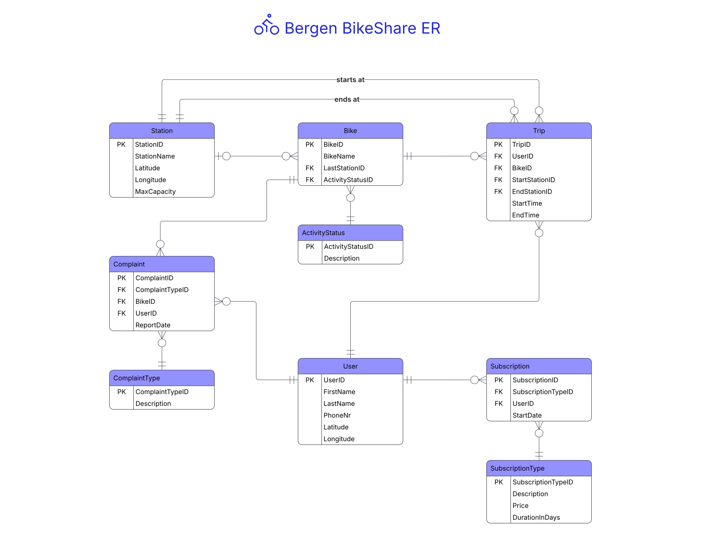

# Bergen BikeShare

A bike-sharing management system built with Python, Shiny and SQLite.

## Overview

Bergen BikeShare is an administrative dashboard for a fictional bike-sharing company operating in Bergen,
Norway.

The system supports:

* Bike fleet management
* Trip monitoring
* Station monitoring
* Maintenance operations and issue tracking
* Subscription and revenue analytics

Originally developed as a university database assignment, the project was later expanded into a portfolio application
featuring a more structured architecture, automated database seeding, testing and a richer administrative experience.

## Tech Stack

* Python
* SQLite
* Shiny for Python
* Pandas
* Pytest
* Faker
* Ruff

## Database Design

    

## Documentation
- [User stories](docs/user_stories.md)
- [Requirements](docs/requirements.md)
